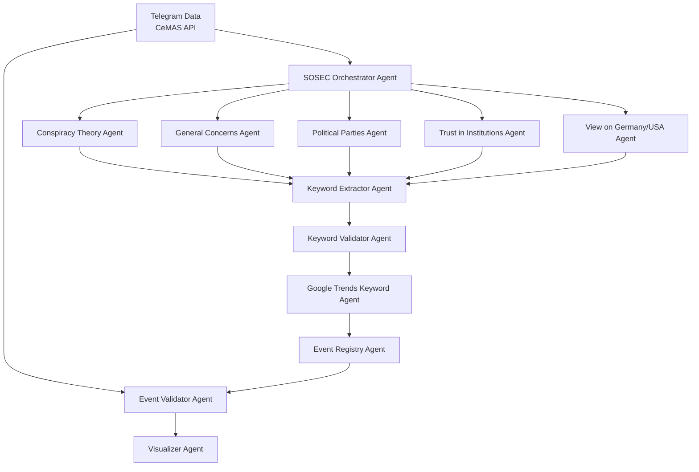

# SOSEC Agentic Framework

This repository contains code to automate the classification and event-matching of Telegram posts.

## Overview

The SOSEC Agentic Framework is designed to automate the classification and event-matching of Telegram posts. It leverages a modular, agent-based architecture to process data from sources like Telegram and the CeMAS API, classify content into thematic categories, extract and validate keywords, enrich them with external data (e.g., Google Trends), and match them with relevant events. The final output is visualized for analysis and decision-making.

## Architecture

The system is composed of interconnected agents, each responsible for a specific task in the data processing pipeline. The flowchart below illustrates the architecture:



## Components

- **SOSEC Orchestrator Agent**: Coordinates the workflow by directing data through various thematic agents.
- **Thematic Agents**: Classify content into specific themes such as conspiracy theories, general concerns, political parties, trust in institutions, and views on Germany/USA.
- **Keyword Extractor Agent**: Extracts relevant keywords from classified content.
- **Keyword Validator Agent**: Validates extracted keywords to ensure relevance and accuracy.
- **Google Trends Keyword Agent**: Enriches validated keywords with trend data from Google Trends.
- **Event Registry Agent**: Matches enriched keywords with relevant events from an event registry.
- **Event Validator Agent**: Validates matched events against original data sources.
- **Visualizer Agent**: Generates visual representations of the final matched events for analysis.

## Getting Started

To set up and run the SOSEC Agentic Framework locally, follow these steps:

### Prerequisites

- Python 3.8 or higher
- [Poetry](https://python-poetry.org/docs/) for dependency management
- Access to required APIs (e.g., Telegram, CeMAS, Google Trends)

### Installation

1. Clone the repository:

   ```bash
   git clone https://github.com/miriamcoccia/sosec-agentic-fw.git
   cd sosec-agentic-fw
   ```


2. Install dependencies using Poetry:

   ```bash
   poetry install
   ```


3. Set up environment variables for API keys and other configurations.

### Running the Framework

To run the entire pipeline:


```bash
poetry run python main.py
```


This will initiate the orchestrator agent, which in turn activates all other agents in the workflow.

## Project Structure


```plaintext
sosec-agentic-fw/
├── agents/                 # Agent definitions and implementations
├── data/                   # Input and output data files
├── notebooks/              # Jupyter notebooks for analysis and prototyping
├── isr_oct_analysis/       # Specific analyses (e.g., Israel-October analysis)
├── main.py                 # Entry point for running the framework
├── pyproject.toml          # Project metadata and dependencies
└── README.md               # Project documentation
```


## Contributing

Contributions are welcome! Please fork the repository and submit a pull request with your changes. Ensure that your code adheres to the existing style and includes appropriate tests.

## License

This project is licensed under the [Apache License 2.0](LICENSE).

---

For more information, visit the [project repository](https://github.com/miriamcoccia/sosec-agentic-fw).
